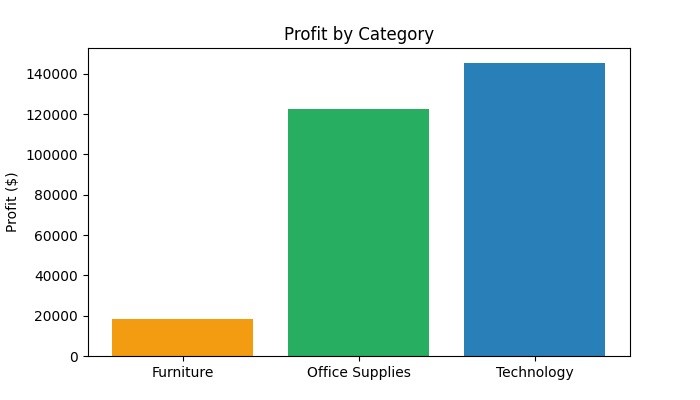
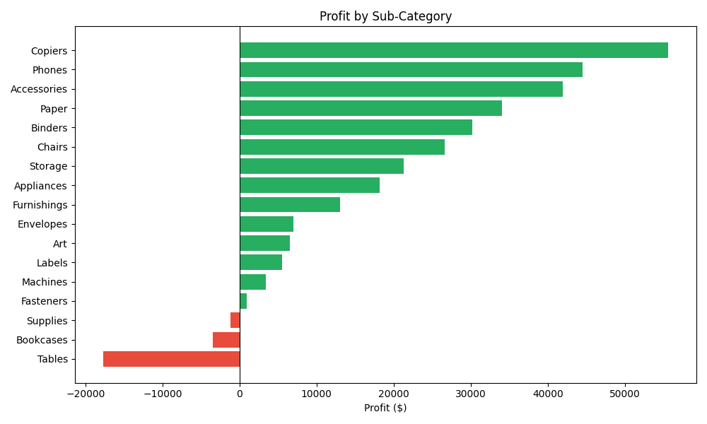
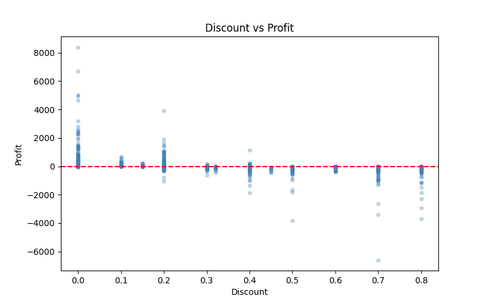

# Retail Business Performance & Profitability Analysis

## Problem Statement
Analyzed 9,994 retail transactions across 4 years to identify 
profit-draining products, regions, and pricing strategies.

## Tools Used
SQL (MySQL) | Python (Pandas, Matplotlib, Seaborn) | Power BI

## Key Findings
- Tables and Bookcases are loss-making despite high sales volume
- Discounts above 20% consistently result in losses
- Discount-Profit correlation: -0.22
- West region is most profitable
- Technology has the highest profit margin

## Business Recommendations
1. Cap discounts at 15% across all categories
2. Reassess pricing strategy for Tables and Bookcases
3. Focus inventory investment on Technology category

## Visualisations



```

3. Click **Commit changes**

---

**Step 6 — Final repo structure check**
Your repo should look like this:
```
Retail-Profitability-Analysis/
├── README.md
├── Retail_Profitability_Analysis.ipynb
├── queries.sql
├── dashboard.pdf
├── profit_by_category.png
├── subcategory_profit.png
├── discount_vs_profit.png
├── profit_by_region.png
└── monthly_trend.png
